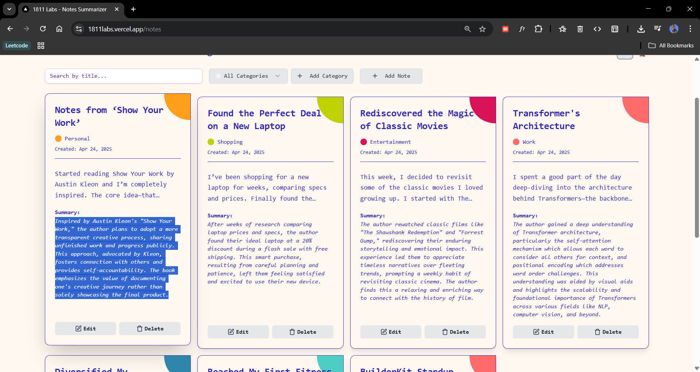
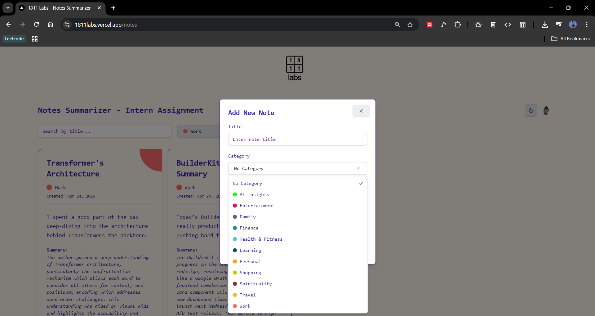

<div align="left">
    
    <div style="padding-left: 15px">
        <h1 style="text-decoration: none; margin: 0; padding: 0; color: #666; font-weight: bold">
            Notes Summarizer
        </h1>
    </div>
</div>

<br clear="both">

A smart note-taking app with AI-powered summarization, built for 1811 Labs using Next.js and Supabase.

[](https://1811labs.vercel.app) 
[](https://nextjs.org)
[](https://tailwindcss.com)

## [Live Demo ](https://1811labs.vercel.app) 
## [Demo Video ](https://drive.google.com/file/d/1qOb_GTfIoBFB7pX5QOXOvd8vUhnMGfLX/view?usp=drive_link) 

<div align="center">
   <!-- Replace with actual demo GIF -->
</div>

## 📸 Application Showcase

<table>
  <tr>
    <td width="50%">
      
      <p align="center"><em>Dashboard: Overview of all notes with filtering options</em></p>
    </td>
    <td width="50%">
      
      <p align="center"><em>Note Card: Compact view with category and summary</em></p>
    </td>
  </tr>
  <tr>
    <td width="50%">
      
      <p align="center"><em>Note Dialog: Full note details with scrollable content</em></p>
    </td>
    <td width="50%">
      
      <p align="center"><em>Filters: Search and categorize notes efficiently</em></p>
    </td>
  </tr>
  <tr>
    <td width="50%">
      
      <p align="center"><em>Add Note: Streamlined form for creating notes</em></p>
    </td>
    <td width="50%">
      
      <p align="center"><em>Add Category: Customize note organization</em></p>
    </td>
  </tr>
  <tr>
    <td width="50%">
      
      <p align="center"><em>Header: User authentication and theme toggle</em></p>
    </td>
    <td width="50%">
      
      <p align="center"><em>Mobile View: Fully responsive design</em></p>
    </td>
  </tr>
</table>

## 🚀 Key Features

- **Elegant UI/UX:** Fully responsive design with smooth interactions and dark mode support.
- **Note Management:** Create, edit, delete, and view notes with AI-generated summaries.
- **Category System:** Organize notes with color-coded categories.
- **Smart Filtering:** Search notes by title and filter by category.
- **Authentication:** Secure user login/logout via Supabase with avatar display.
- **Content Confinement:** Scrollable cards and dialogs for long content, capped at 90vh.
- **Real-Time Updates:** Sync user auth state with Supabase.
- **Robust Validation:** Type-safe data handling with TypeScript.

## 💻 Technology Stack

- Next.js 14+
- TypeScript
- Tailwind CSS
- Shadcn/UI
- Supabase (Authentication & Database)
- Lucide Icons
- Date-fns

## 🛠️ Setup Guide


```bash
# 1. Clone the Repo
git clone https://github.com/rixitgithub/1811labs-notesapp.git
cd 1811labs-notesapp
```


```bash
# 2. Install Dependencies
npm install
```


```env
# 3. Configure Environment Variables
#Create a `.env.local` file in the root of the project and add the following:
NEXT_PUBLIC_SUPABASE_URL=https://your-supabase-url.supabase.co  
NEXT_PUBLIC_SUPABASE_ANON_KEY=your-supabase-anon-key  
NEXT_PUBLIC_GOOGLE_API_KEY=your-google-api-key  
NEXT_PUBLIC_SITE_URL=http://localhost:3000  
```

⚠️ Replace all placeholder values with your actual credentials.


```bash
# 4. Start the Development Server
npm run dev
```
Access the application at `http://localhost:3000`

## 📁 Project Architecture
```plaintext
src/
│
├── app/
│   ├── api/
│   │   └── summarize/
│   │       └── route.ts         # API route to summarize notes (likely using AI)
│   ├── auth-callback/
│   │   └── route.ts             # Handles OAuth or third-party auth callback
│   └── notes/
│       ├── AddCategory.tsx      # Add note categories
│       ├── AddNoteDialog.tsx    # Dialog for adding a new note
│       ├── EditNoteDialog.tsx   # Dialog for editing existing notes
│       ├── Filters.tsx          # Filters to search/sort notes
│       ├── Header.tsx           # Header for notes section
│       ├── NoteCard.tsx         # Card-style note component
│       ├── page.tsx             # Notes landing page
│       └── ThemeToggle.tsx      # Toggle for dark/light mode
│
├── components/ui/
│   ├── button.tsx               # Custom button component
│   ├── card.tsx                 # Reusable card component
│   ├── dialog.tsx               # Dialog base component
│   ├── input.tsx                # Styled input field
│   ├── label.tsx                # Label for inputs
│   ├── select.tsx               # Custom select dropdown
│   └── textarea.tsx             # Styled textarea
│
├── hooks/
│   └── useStore.ts              # Global state management
│
├── lib/
│   └── utils.ts                 # General utilities
│
├── utils/supabase/
│   ├── client.ts                # Supabase client initialization
│   └── server.ts                # Supabase server-side logic
│
├── favicon.ico
├── globals.css                 # Global styles
├── layout.tsx                  # Root layout
├── page.tsx                    # Entry page
├── Providers.tsx               # Context providers
└── ThemeHeader.tsx             # App-wide header with theme toggle
```

## 👨‍💻 Developer Profile

**Rishit Tiwari**

[](https://github.com/rixitgithub) 
[](https://www.linkedin.com/in/rishit-tiwari/) 
[](https://rishittiwari.vercel.app/) 

## 🙏 Acknowledgments

Grateful to 1811 Labs for the opportunity to build this project and showcase frontend development skills with AI integration.

---

<div align="center">

### Crafted with ❤️ for 1811 Labs
</div>
